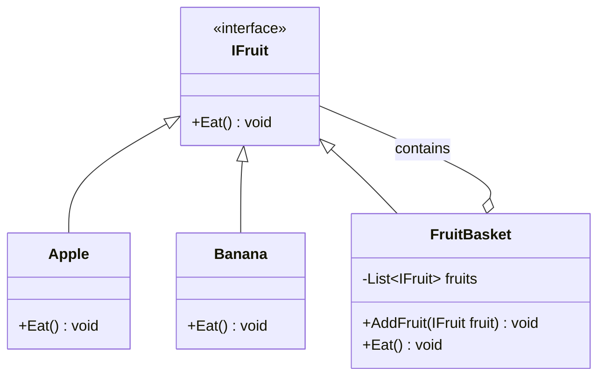

# Composite Pattern Example - Fruit Basket


## 📖 Introduction

Welcome to the **Composite Pattern Implementation** repository! This C# example demonstrates the Composite design pattern through a practical and relatable scenario - a fruit basket system. The Composite Pattern is a structural design pattern that allows you to compose objects into tree structures to represent part-whole hierarchies, letting clients treat individual objects and compositions uniformly.

In this implementation, we use fruits and fruit baskets to show how both simple fruits and complex collections of fruits can be treated identically through a common interface.

## 🎯 Purpose

The main goal of this project is to provide a clear, easy-to-understand example of the Composite Pattern. This pattern is particularly useful when:
- You want to represent part-whole hierarchies of objects
- You want clients to be able to ignore the difference between compositions of objects and individual objects
- You need to treat both single elements and groups of elements uniformly

## 🏗️ Architecture

### Category Structure



### Pattern Components

| Component | Type | Description |
|-----------|------|-------------|
| **IFruit** | Interface | The common interface for both leaf and composite objects |
| **Apple** | Leaf | A simple fruit object that implements IFruit |
| **Banana** | Leaf | Another simple fruit object that implements IFruit |
| **FruitBasket** | Composite | A container that can hold multiple IFruit objects (both leaves and other composites) |

## 📁 Repository Structure

```
Composite-Pattern/
├── CompositePattern.sln          # Visual Studio solution file
├── CompositePattern.csproj       # C# project file
├── Program.cs                    # Main implementation file
└── README.md                     # This documentation file
```

## 🚀 Getting Started

### Prerequisites
- [.NET SDK](https://dotnet.microsoft.com/download) (7.0 or higher)
- Visual Studio or any C# IDE (optional)
- Git (for cloning the repository)

### Installation & Usage

1. **Clone the repository**
   ```bash
   git clone https://github.com/Vineet-Sharma-Microsoft/Composite-Pattern.git
   cd Composite-Pattern
   ```

2. **Run the application**
   ```bash
   dotnet run
   ```

3. **Expected Output**
   ```
   Eating from individual fruits:
   Eating an apple
   Eating a banana
   
   Eating from the fruit basket:
   Eating an apple
   Eating a banana
   
   Eating from the fruit basket:
   Eating an apple
   ```

## 💡 Key Concepts Illustrated

### 1. **Uniform Treatment**
Both individual fruits (`Apple`, `Banana`) and fruit baskets (`FruitBasket`) implement the same `IFruit` interface, allowing them to be treated uniformly.

### 2. **Recursive Composition**
A `FruitBasket` can contain other `FruitBasket` objects, creating complex tree structures.

### 3. **Transparency**
The composite interface includes all methods that make sense for both leaves and composites, providing transparency to the client.

## 🔄 How It Works

1. **Define a common interface** (`IFruit`) with the `Eat()` method
2. **Create leaf classes** (`Apple`, `Banana`) that implement the interface
3. **Create a composite class** (`FruitBasket`) that:
   - Implements the same interface
   - Contains a collection of `IFruit` objects
   - Delegates operations to its children
4. **Build complex structures** by combining leaves and composites
5. **Treat all objects uniformly** through the common interface

## 🎯 Real-World Applications

The Composite Pattern is widely used in:
- **GUI Frameworks**: Treating individual widgets and container widgets uniformly
- **File Systems**: Files and directories with common operations
- **Organization Structures**: Employees and departments
- **Graphics Systems**: Shapes and groups of shapes

## 📝 Code Highlights

```csharp
// The power of the pattern: treating individual and composite objects the same way
IFruit singleApple = new Apple();
IFruit basket = new FruitBasket();

// Both can be "eaten" through the same interface
singleApple.Eat();    // Works!
basket.Eat();         // Also works!
```

## 🤝 Contributing

Contributions are welcome! If you have improvements or additional examples:
1. Fork the repository
2. Create your feature branch (`git checkout -b feature/AmazingFeature`)
3. Commit your changes (`git commit -m 'Add some AmazingFeature'`)
4. Push to the branch (`git push origin feature/AmazingFeature`)
5. Open a Pull Request

## 📄 License

This project is for educational purposes as part of demonstrating design patterns.

## 🙏 Acknowledgments

- **Design Patterns**: Original concept from the Gang of Four book
- **.NET Community**: For providing excellent tools and documentation
- **Open Source Community**: For continuous inspiration and collaboration

## 📧 Contact

Vineet Sharma - [GitHub Profile](https://github.com/Vineet-Sharma-Microsoft)

Project Link: [https://github.com/Vineet-Sharma-Microsoft/Composite-Pattern.git](https://github.com/Vineet-Sharma-Microsoft/Composite-Pattern.git)

---

⭐ **Star this repo** if you found it helpful for learning the Composite Pattern!
